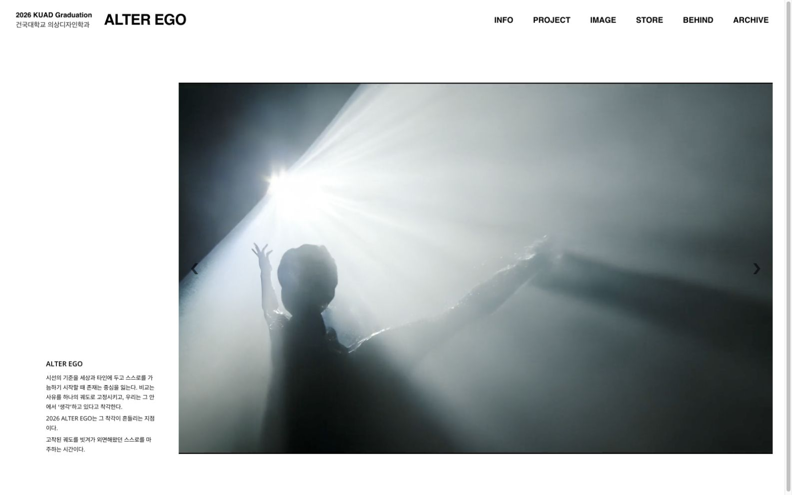
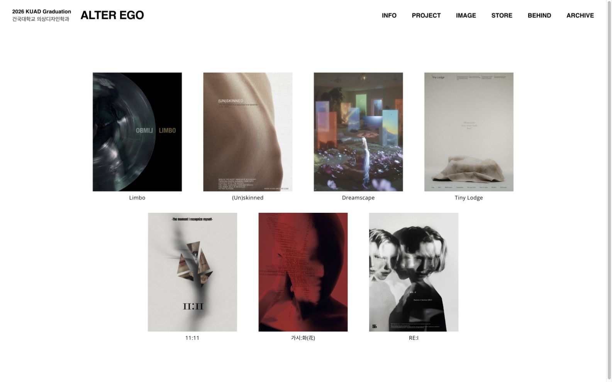
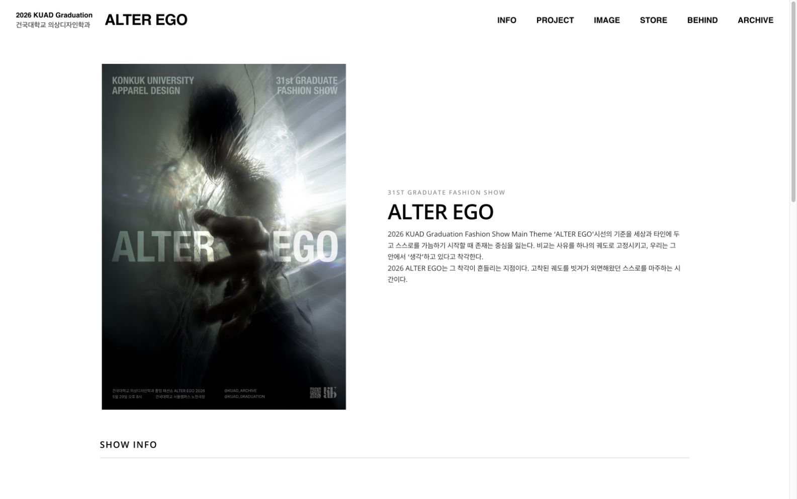
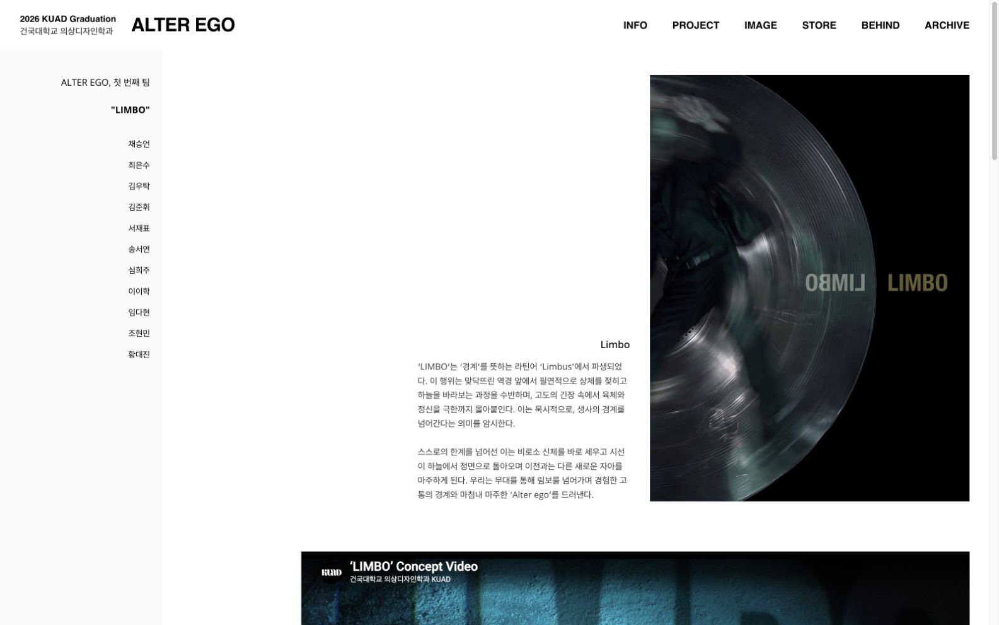
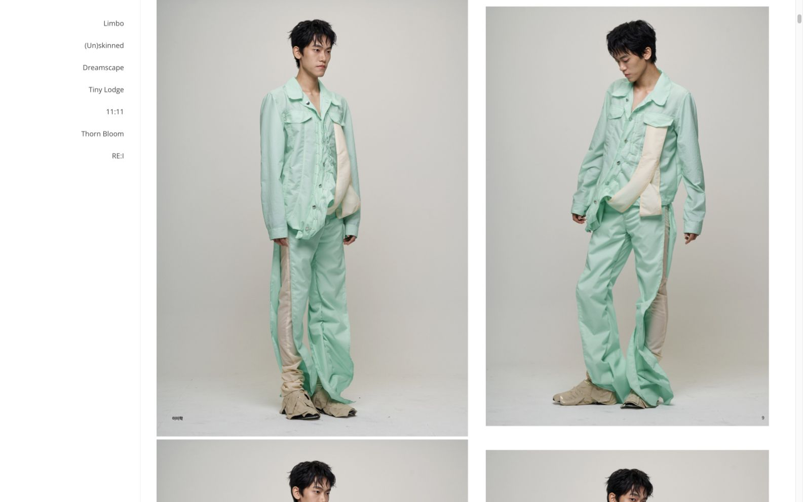
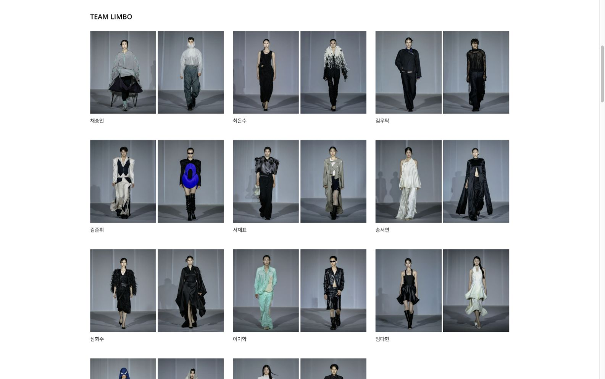
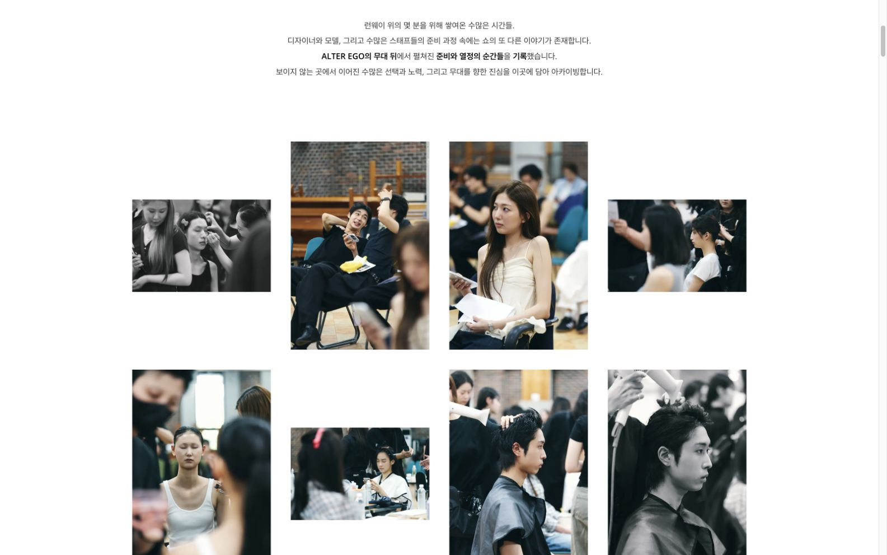
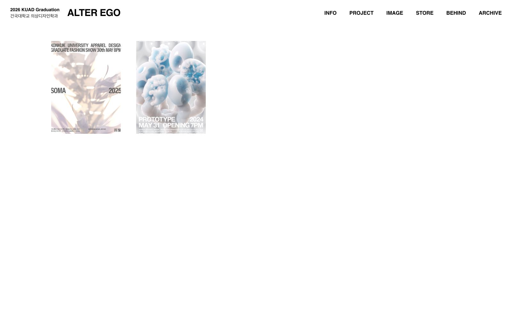

# KUAD 2026 · ALTER EGO

**건국대학교 의상디자인학과 2026 졸업전시를 담은 웹사이트입니다.**

전시장에서 만난 작품을 온라인에서도 이어서 감상할 수 있도록, 일곱 팀의 이야기와 디자이너의 포트폴리오, 룩북과 런웨이, 무대 뒤의 순간들을 한곳에 모았습니다. 이 저장소는 웹사이트의 프론트엔드와 배포 설정을 관리합니다.

[웹사이트 둘러보기 →](https://www.kuadarchive.com/2026/)

## 전시 소개

**ALTER EGO**는 타인의 시선과 비교에서 벗어나, 외면해 왔던 자신의 모습을 마주하는 데서 출발합니다. 각 팀은 이 주제를 서로 다른 시각으로 풀어내고, 의상과 이미지, 영상으로 자신만의 이야기를 전합니다.

참여 프로젝트는 **Limbo · (Un)skinned · Dreamscape · Tiny Lodge · 11:11 · 가시:화(花) · RE:I**입니다.

## 미리보기

운영 웹사이트를 **1600 × 1000 데스크톱 뷰포트(16:10)**에서 촬영했습니다. 이미지를 클릭하면 크게 볼 수 있습니다. 룩북·런웨이·비하인드는 작품과 사진 갤러리가 보이는 구간입니다.

### 메인

전시 영상과 ALTER EGO의 주제를 소개하는 첫 화면입니다.



### 프로젝트

일곱 팀의 포스터를 한눈에 살펴보고 팀별 이야기로 이동합니다.



### 주요 페이지

| 전시 소개 · INFO | 팀 상세 · LIMBO |
| --- | --- |
|  |  |
| 전시의 주제와 쇼 정보를 안내합니다. | 팀의 콘셉트와 디자이너의 작품으로 이어집니다. |

| 룩북 · LOOKBOOK | 런웨이 · RUNWAY |
| --- | --- |
|  |  |
| 의상의 디테일을 룩북으로 감상합니다. | 무대 위 작품을 디자이너별로 살펴봅니다. |

| 비하인드 · BEHIND | 이전 전시 · ARCHIVE |
| --- | --- |
|  |  |
| 전시를 준비한 사람들과 과정을 기록합니다. | 이전 연도 전시 웹사이트로 연결됩니다. |

*2026년 9월 22일 촬영. 메인 영상은 재생 시점에 따라 다른 장면이 표시됩니다.*

## 사이트에서 볼 수 있는 것

| 메뉴 | 소개 |
| --- | --- |
| **HOME · INFO** | 전시의 주제와 영상, 쇼 정보 |
| **PROJECT** | 일곱 팀의 콘셉트와 작품, 참여 디자이너의 포트폴리오 |
| **IMAGE** | 룩북과 런웨이 사진을 모은 갤러리 |
| **BEHIND** | 전시를 준비한 사람들과 무대 뒤의 과정을 담은 영상·사진 |
| **ARCHIVE** | 2024년과 2025년 전시로 이어지는 기록 |

사진 갤러리는 썸네일로 둘러보고, 이미지를 크게 열어 감상할 수 있습니다. 데스크톱과 모바일 화면에 맞춰 레이아웃이 달라집니다.

### 스토어와 운영 기능

전시 굿즈 판매를 위한 상품 목록, 옵션 선택, 주문서 작성, 주문 완료 화면도 구현되어 있습니다. **현재 코드에서는 스토어와 주문 관련 경로가 판매 종료 안내로 연결됩니다.**

관리자 화면에는 주문 조회, 입금 상태 변경, 상품 품절 관리, 기간별 엑셀 다운로드 기능이 있습니다. 이러한 기능은 별도 백엔드 API와 연동되며, 이 저장소에는 서버와 데이터베이스 구현이 포함되어 있지 않습니다.

## 사용한 기술

- **화면:** React 19, JavaScript, React Router 7, Tailwind CSS 3
- **개발·API 연동:** Vite 6, Axios
- **배포:** GitHub Actions, AWS S3, CloudFront

런웨이 갤러리는 목록에서 경량 썸네일을 사용하고, 큰 이미지는 모달을 열 때 불러오도록 구성했습니다. 구현 과정은 [런웨이 최적화 PR #27](https://github.com/jayyeong/ALTEREGO_2026_VITE/pull/27)에서 확인할 수 있습니다.

## 로컬에서 실행하기

배포 환경과 동일한 Node.js 20과 npm을 기준으로 합니다.

```bash
git clone https://github.com/jayyeong/ALTEREGO_2026_VITE.git
cd ALTEREGO_2026_VITE
npm ci
npm run dev
```

실행 후 [http://localhost:5173/2026/](http://localhost:5173/2026/)에 접속합니다. 포트가 사용 중이면 터미널에 표시된 주소를 사용하세요.

이미지와 영상은 `public/`의 정적 리소스를 사용합니다. 일부 폴더를 제외하는 sparse checkout을 사용했다면 해당 리소스도 받아야 화면이 정상적으로 표시됩니다.

### 환경 설정

개발 환경은 `.env.development.local`, 운영 빌드는 `.env.production.local`에서 필요한 값을 설정할 수 있습니다.

```env
VITE_API_URL=
VITE_STORE_ONLY_MODE=false
```

| 변수 | 설명 |
| --- | --- |
| `VITE_API_URL` | 백엔드 API 주소입니다. 비워 두면 현재 사이트의 origin을 기준으로 요청합니다. |
| `VITE_STORE_ONLY_MODE` | 프로덕션 빌드에서 값이 정확히 `true`일 때 전시 페이지 접근을 제한합니다. 개발 서버에는 적용되지 않습니다. |

API 기능을 사용하려면 별도 백엔드 연결이 필요합니다. `VITE_` 환경 변수는 브라우저에 공개되므로 비밀 키를 넣지 않습니다.

공개 모드는 화면 표시를 제어하는 설정이며, 브라우저별 접근 예외가 있습니다. API 인증·인가를 대신하지 않습니다. 이 설정을 바꾸더라도 현재 스토어·주문 경로가 다시 열리지는 않습니다. 자세한 동작은 [라우트 설정](src/App.jsx)과 [공개 모드 설정](src/config/siteMode.js)을 참고하세요.

### 빌드와 미리보기

```bash
npm run build
npm run preview
```

빌드 결과는 `dist/`에 생성됩니다. 미리보기 서버가 안내하는 주소의 `/2026/` 경로에서 확인할 수 있습니다.

## 폴더 구성

```text
src/
  components/        헤더, 스크롤 처리 등 공통 UI
  config/            API 주소와 페이지 공개 설정
  data/              팀, 디자이너, 상품 관련 데이터
  pages/             전시, 스토어, 관리자 화면
  utils/             이미지 경로, 날짜 표시 등 공통 함수
public/              이미지와 영상 등 정적 리소스
docs/screenshots/    README에 사용하는 웹사이트 화면
.github/workflows/   배포 자동화 설정
```

## 배포

같은 도메인에서 연도별 전시를 운영하기 위해 `/2026/`을 기본 경로로 사용합니다. `main` 브랜치에 변경사항을 push하거나 워크플로를 수동 실행하면 다음 순서로 배포됩니다.

```text
의존성 설치 → Vite 빌드 → S3 업로드 → CloudFront 캐시 갱신
```

정적 자산에는 장기 캐시를 적용하고, HTML·아이콘·manifest는 새 내용을 확인하도록 별도 캐시 정책을 사용합니다. 자세한 설정은 [배포 워크플로](.github/workflows/deploy.yml)에 있습니다. README만 변경해도 현재 워크플로의 배포 조건에 해당합니다.

## 개발 참고

현재 자동 테스트와 lint 스크립트는 없으며, 배포 과정에서는 의존성 설치와 빌드를 수행합니다. 주문 입력·오류 처리, 관리자 API 권한, 이미지 모달의 키보드 포커스는 추가 검증 대상으로 남아 있습니다.

이전 Create React App 기반 구현은 [ALTEREGO_2026](https://github.com/jayyeong/ALTEREGO_2026)에서 확인할 수 있습니다.
